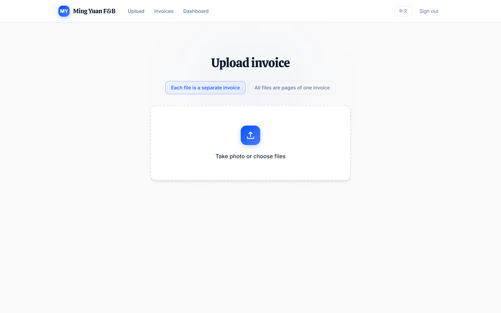
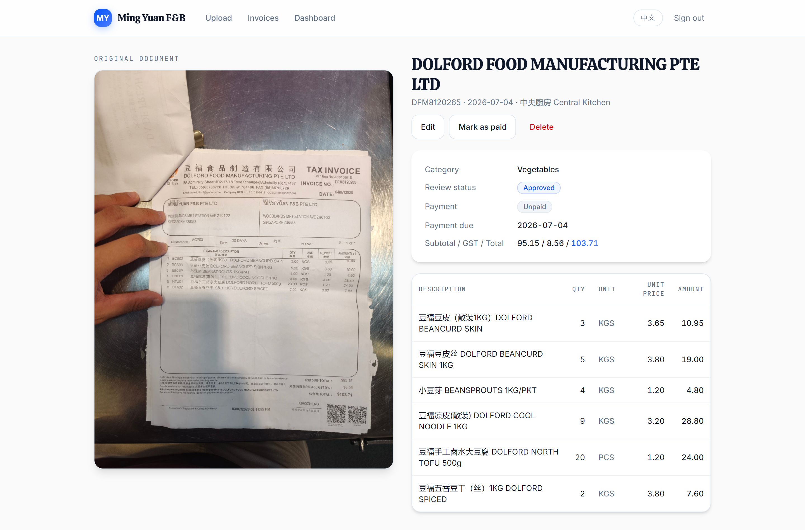
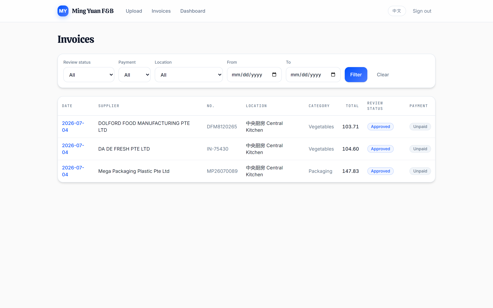
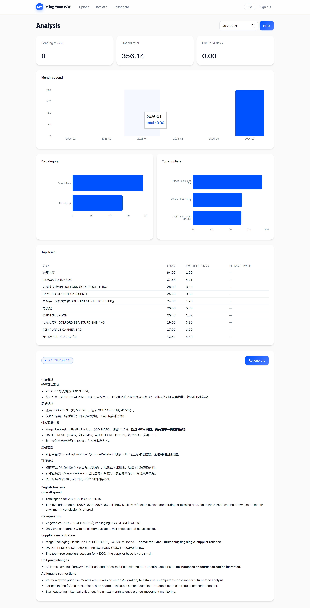

# F&B Invoice Manager

**AI-powered, bilingual invoice management for a real Singapore F&B business.** Staff photograph paper invoices at the loading dock; Claude reads them — English, Simplified Chinese, or mixed — and turns them into structured, searchable, analyzable purchasing data. Built for (and battle-tested by) a family-run chain of Chinese food outlets, shipped as a white-label product.

      

## The problem

A multi-outlet F&B business receives dozens of paper invoices a week — thermal receipts from the egg supplier, bilingual tax invoices from vegetable wholesalers, monthly rent bills — in a mix of Chinese and English, often crumpled and photographed one-handed at a stainless-steel counter. They pile up in a drawer. Nobody knows which are paid, what the eggs cost last month, or whether one supplier quietly became 40% of total spend.

This app replaces the drawer.

## Screenshots

**Upload — batch mode by default.** Select up to 10 photos; each file is extracted in parallel and auto-saved as its own invoice. A toggle handles genuine multi-page invoices.



**Extraction — the original document beside the structured result.** Verbatim line items (never translated away), standardized bilingual names underneath, GST arithmetic checked, outlet auto-detected from branch codes like "WLD" or 兀兰 printed on the invoice.



**Invoice list — every invoice individually, filterable.** Status chips for review and payment state; due dates auto-computed from each supplier's credit terms.



**Analysis dashboard — with an AI purchasing analyst.** Monthly spend, category mix, supplier concentration, per-item price movement — and a cached, bilingual monthly report written by Claude that flags things like single-supplier dependence crossing the 40% threshold.



## Features

- 📸 **Snap & extract** — photos and PDFs; Claude Opus 4.8 vision with structured outputs (zod-validated JSON, never free text)
- 🈶 **Truly bilingual** — UI in 中文/English (one toggle, parity-tested translation files); item names stored verbatim *plus* standardized English and Chinese forms for analytics
- ⚡ **Batch auto-save** — clean extractions save themselves; only problem cases (possible duplicate, unreadable photo, non-invoice document) ask a human
- 🏪 **Outlet auto-detection** — matches branch codes, Chinese names, addresses, and postal codes printed on the invoice against a per-outlet alias list in the database
- 🔍 **Supplier fuzzy matching** — "MEGA PACKAGING PLASTIC PTE. LTD." and "Mega Packaging Plastic" are the same vendor; Chinese aliases supported
- 💰 **Payment tracking** — unpaid/paid with due dates from supplier credit terms; duplicate-invoice detection before anything double-saves
- 📊 **Admin dashboard + AI insights** — recharts visualizations plus a Claude-written monthly report (bilingual, cached per month, regenerate on demand)
- 🎨 **White-label** — one config file (`src/branding.ts`) sets the name, logo, and accent colors for an entire deployment; every gradient, button, chip, and chart follows
- 🔐 **Real security model** — Supabase Row-Level Security enforces staff/admin roles at the database layer; the UI gates are convenience, not the boundary

## How extraction works

```
photo/PDF ──▶ Supabase Storage (file saved first — extraction failure never loses a document)
                   │
                   ▼
        Claude Opus 4.8 (vision + structured outputs)
        document type · supplier · outlet hint · dates · GST
        line items: verbatim description + standardized name_en/name_zh
                   │
                   ▼
        server-side matching: supplier (dice-coefficient fuzzy) · outlet (alias list) · duplicates
                   │
                   ▼
        auto-save as pending_review ──▶ list · detail · dashboard · AI monthly report
        (problem cases → human review form)
```

## Tech stack

| Layer | Choice |
|---|---|
| Framework | Next.js 16 (App Router, RSC) + TypeScript |
| UI | Tailwind CSS v4 (CSS-first tokens) + shadcn/ui, restyled to a custom design system |
| Database / Auth / Storage | Supabase (Postgres + RLS, email auth, private bucket with signed URLs) |
| AI | Anthropic API — `claude-opus-4-8`, vision + structured outputs; ~US$0.03–0.05 per invoice |
| Charts | recharts |
| i18n | next-intl (cookie locale, no URL prefixes) |
| Tests | Vitest — 66 unit tests + a golden set of real invoices for extraction regression |

## Getting started

```bash
git clone https://github.com/moleicafe/fnb-invoice-manager && cd fnb-invoice-manager
npm install
cp .env.example .env.local   # fill in Supabase URL/key + Anthropic API key
```

1. Create a [Supabase](https://supabase.com) project and run each file in `supabase/migrations/` (001 → 004) in the SQL editor.
2. Create users in Supabase Auth; promote your account: `update profiles set role = 'admin' where user_id = (select id from auth.users where email = 'you@example.com');`
3. `npm run dev` → sign in → upload an invoice.

**Testing extraction against real documents:** put samples in `samples/` (gitignored) and run
`npm run extract:sample -- samples/your-invoice.jpg` to see exactly what Claude returns.

## White-labelling

Everything customer-facing lives in [`src/branding.ts`](src/branding.ts):

```ts
export const BRANDING = {
  appName: { en: 'Ming Yuan F&B', 'zh-CN': 'Ming Yuan F&B' },
  logoGlyph: 'MY',            // or point logoUrl at /public/logo.png
  logoUrl: null,
  accent: '#0052ff',          // re-skins every gradient, button, chip, and chart
  accentSecondary: '#4d7cff',
};
```

One deployment per customer (own Supabase + own Vercel project + this file) keeps every business's data fully isolated.

## Roadmap

- Monthly statement (账单) reconciliation — auto-match supplier statements against received invoices
- Excel/GST export for the accountant
- Supplier & user admin screens; per-item canonical catalog
- Per-user rate limiting on extraction

## License

MIT — see [LICENSE](LICENSE).
